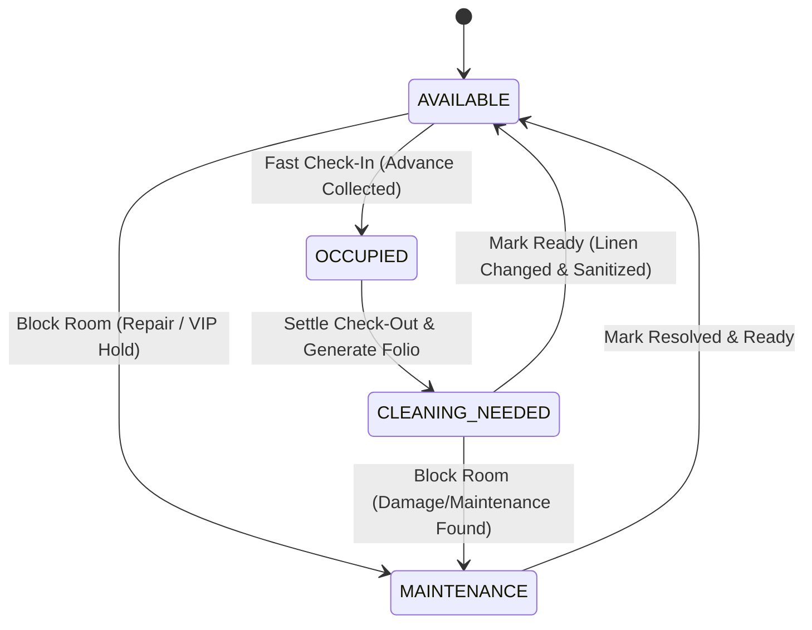

# Sri Bhavani Vasavi Bhavan PMS (Property Management System)

<div align="center">

**Custom 12-Room Front-Desk Hotel & Pilgrimage Guest House Management System**  
*85/32, Old Karkana Street, Backside Road, opp. Park Danish Mission Higher Secondary School, Tiruvannamalai, Tamil Nadu 606601*  
*Phone: +91 94432 58190 / +91 4175 224501 | Email: reception@sribhavanivasavibhavan.com*

[](https://react.dev/)
[](https://www.typescriptlang.org/)
[](https://tailwindcss.com/)
[](https://expressjs.com/)
[](https://vitejs.dev/)

</div>

---

## 📖 Executive Summary & Property Context

**Sri Bhavani Vasavi Bhavan PMS** is an operations-focused Property Management System specifically engineered for a high-turnaround pilgrimage lodge located near the sacred Arunachaleswarar Temple in Tiruvannamalai, Tamil Nadu.

Pilgrim lodges in Tiruvannamalai operate under vastly different dynamics than conventional business hotels:
1. **Surge & Demand Pricing**: Tariffs vary dynamically based on temple events (*Pournami* full moon, *Girivalam* circumambulation days, *Karthigai Deepam* festival, weekend spikes). Fixed rate cards do not reflect ground realities; receptionists need instant custom tariff inputs with one-click presets.
2. **Hybrid AC / Non-AC Architecture**: Every room in the property is physically fitted with an air-conditioning unit. However, rooms are flexibly booked as either **AC** or **Non-AC** based on guest budget. Receptionists require an instant one-click toggle to activate or deactivate AC modes.
3. **24-Hour Stay Cycle vs 11:00 AM Standard**: Pilgrims arriving at odd hours (e.g., 9:00 PM for Girivalam) expect a 24-hour cycle checkout, while commercial guests follow standard 11:00 AM rules. The billing engine seamlessly supports both with automatic grace-period math.
4. **Zero-Tab Front Desk Efficiency**: The entire property of 12 rooms is visible on a single real-time dashboard with zero navigation overhead, modal-driven workflows, multi-device synchronization, and instant printable GST/non-GST folios.

---

## 🏛️ Physical Inventory & Room Allocation

The lodge comprises **11 total rooms** across two physical floors:

```
                          ┌──────────────────────────────────────┐
                          │   Sri Bhavani Vasavi Bhavan (11 R)   │
                          └──────────────────┬───────────────────┘
                                             │
               ┌─────────────────────────────┴─────────────────────────────┐
               ▼                                                           ▼
    ┌─────────────────────────┐                                 ┌─────────────────────────┐
    │  Ground Floor (6 Rooms) │                                 │  First Floor (5 Rooms)  │
    ├─────────────────────────┤                                 ├─────────────────────────┤
    │ Room 101 (Double Bed, 3)│                                 │ Room 106 (Triple Bed, 4)│
    │ Room 102 (Double Bed, 3)│                                 │ Room 107 (Double Bed, 3)│
    │ Room 103 (Double Bed, 3)│                                 │ Room 108 (Double Bed, 3)│
    │ Room 104 (Double Bed, 3)│                                 │ Room 109 (Double Bed, 3)│
    │ Room 105 (Non-AC Bed, 3)│                                 │   [NON-AC ROOM]         │
    │ Room 111 (Triple Bed, 4)│                                 │ Room 110 (King Bed, 4)  │
    └─────────────────────────┘                                 │   [NON-AC ROOM]         │
                                                                └─────────────────────────┘
```

| Room No. | Floor | Floor Code | Bed Configuration | Max Occupancy | AC Equipped | Default Mode |
|:---:|:---:|:---:|:---:|:---:|:---:|:---:|
| **101** | Ground Floor | `0` | Double Bed | 3 Guests | Yes | AC Active (Toggle to Turn Off) |
| **102** | Ground Floor | `0` | Double Bed | 3 Guests | Yes | AC Active (Toggle to Turn Off) |
| **103** | Ground Floor | `0` | Double Bed | 3 Guests | Yes | AC Active (Toggle to Turn Off) |
| **104** | Ground Floor | `0` | Double Bed | 3 Guests | Yes | AC Active (Toggle to Turn Off) |
| **105** | Ground Floor | `0` | Double Bed | 3 Guests | **No** | **Dedicated Non-AC Room** |
| **111** | Ground Floor | `0` | Triple Bed | 4 Guests | Yes | AC Active (Toggle to Turn Off) |
| **106** | First Floor  | `1` | Triple Bed | 4 Guests | Yes | AC Active (Toggle to Turn Off) |
| **107** | First Floor  | `1` | Double Bed | 3 Guests | Yes | AC Active (Toggle to Turn Off) |
| **108** | First Floor  | `1` | Double Bed | 3 Guests | Yes | AC Active (Toggle to Turn Off) |
| **109** | First Floor  | `1` | Double Bed | 3 Guests | **No** | **Dedicated Non-AC Room** |
| **110** | First Floor  | `1` | King Bed   | 4 Guests | **No** | **Dedicated Non-AC Room** |

> **Pricing**: No fixed rate cards. Every room supports flexible, demand-driven custom pricing entered at check-in based on festival (*Pournami / Girivalam / Deepam*) and weekend demand.

---

## 🔄 Room Lifecycle & Operational State Machine

Every room transitions between four deterministic states:



1. **`AVAILABLE` (Emerald)**:
   - Room is vacant, clean, inspected, and ready for allocation.
   - Primary action: **Check-In** (opens check-in modal) or **Block** (puts under maintenance).
2. **`OCCUPIED` (Rose)**:
   - Guest is currently checked in.
   - Room card displays live guest name, primary phone, origin city, agreed tariff/day, stay duration, advance paid, and balance due.
   - Primary action: **Guest Folio & Billing** (opens interaction tracker, add-on charges, and checkout settlement).
3. **`CLEANING_NEEDED` (Amber)**:
   - Triggered automatically upon checkout completion.
   - Flags room for housekeeping: linen replacement, floor mop, bathroom disinfection.
   - Primary action: 1-click **Mark Ready** (immediately returns to `AVAILABLE`).
4. **`MAINTENANCE` (Stone/Slate)**:
   - Room is blocked from front-desk allocation with a logged maintenance reason (e.g., *AC Servicing*, *Plumbing Leakage*, *Electrical/Geyser Work*, *Painting*, *Sanitation/Pest Control*, *Owner VIP Reservation*).
   - Primary action: **Mark Resolved & Ready** or **Edit Reason**.

---

## ⚡ Core Features & Capabilities

### 1. Hybrid AC / Non-AC Power Toggle
- Every room card has an integrated **AC Power Switch** (`Turn ON` / `Turn OFF`).
- Allows staff to toggle `isAcActive` on the fly.
- Reflects whether the customer opted for AC or Non-AC tariff, instantly updating dashboard filters and guest folio billing.

### 2. Fast Pilgrimage Check-In Engine (`CheckInModal.tsx`)
- Captures guest identity:
  - Full Name & Primary 10-Digit Phone
  - Alternate Contact
  - Government ID Verification (Aadhaar, Voter ID, Driving License, Passport) & Document ID number
  - Origin City & State (mandatory for pilgrim compliance)
  - Vehicle Registration Number
  - Adult and Child headcounts
- **Demand-Driven Tariff Selection**:
  - One-click preset tariff buttons: `₹800`, `₹1,000`, `₹1,200`, `₹1,500`, `₹1,800`, `₹2,000`, `₹2,500`, `₹3,000`
  - Custom tariff input for arbitrary festival demand rates
- **Billing Cycle Selector**: Choose between `24_HOUR_CYCLE` and `STANDARD_11AM`
- **Optional Extra Bed / Mattress**: `+₹150 / day` per bed with counter
- **Advance Payment Collection**:
  - Cash, UPI (GPay/PhonePe), or Card (POS)
  - Reference number / UTR / Cash Slip logging
- **Initial Front-Desk Note**: Logs special requests (extra pillows, late arrival, temple timings).

### 3. Guest Profile & In-Stay Management (`GuestProfileModal.tsx`)
Tabbed modal with zero page reloads:
- **Overview Tab**: Complete guest folio overview, agreed tariff, duration counter, advance summary, and one-click access to check-out.
- **Interactions Tab**: Multi-category chronological communication thread:
  - `Phone Call`
  - `Room Service`
  - `Extra Bed / Towel`
  - `Complaint`
  - `Front Desk Note`
  - Staff attribution, timestamps, and status (`Open`, `Resolved`, `Logged`).
- **Ancillary Charges Tab**:
  - Quick presets: Bisleri 1L Bottle (`₹20`), Filter Coffee/Tea (`₹25`), Laundry (`₹150`), Extra Mattress (`₹150/day`), Late Check-out Fee (`₹300`), or Custom Charges.
  - Automatically calculates item totals and adds to bill subtotal.

### 4. Mathematical Billing & Checkout Engine (`CheckOutModal.tsx` & `billing.ts`)
- **Stay Calculation Logic**:
  - **24-Hour Cycle (`24_HOUR_CYCLE`)**:
    ```typescript
    if (diffHours <= 25) {
      daysStayed = 1; // 1-hour grace period
    } else {
      daysStayed = Math.ceil((diffHours - 1) / 24);
    }
    ```
  - **Standard 11:00 AM (`STANDARD_11AM`)**:
    ```typescript
    if (dayDiff <= 0) {
      daysStayed = 1;
    } else if (dayDiff === 1 && checkOut.getHours() <= 12) {
      daysStayed = 1; // Grace period up to 12:00 PM
    } else {
      daysStayed = Math.max(1, dayDiff + (checkOut.getHours() > 12 ? 1 : 0));
    }
    ```
- **Folio Computation**:
  - Room Lodging Rent: `daysStayed * tariffPerDay`
  - Extra Bed Total: `daysStayed * extraBedCount * 150`
  - Add-on Charges: Sum of all folio room charge line items
  - `Subtotal = Room Rent + Extra Bed + Ancillary Charges`
  - **GST Option**: Optional 12% GST (6% CGST + 6% SGST) toggleable on the checkout screen.
  - **Concession / Rounding**: Custom management discount input.
  - `Grand Total = Subtotal + GST - Discount`
  - `Balance Due = max(0, Grand Total - Advance Paid)`
- **One-Click Handover**:
  - Final settlement collected via Cash, UPI, or Card with receipt reference.
  - Room status automatically transitions to `CLEANING_NEEDED`.
  - Automatically opens the **Printable Tax Invoice / Folio Modal**.

### 5. Printable Folio & Official Tax Invoice (`InvoicePrintModal.tsx`)
- Optimized with `@media print` CSS rules (hides all app navigation, backgrounds, and action buttons).
- Full legal invoice layout:
  - Lodge header: Name, tagline, address, front desk contact numbers, email
  - GSTIN (`33AABCS1234F1Z5`) and HSN/SAC Code (`996311` for Accommodation)
  - Folio serial number (`SBVB-YYYY-XXXX`)
  - Two-column guest particulars vs stay particulars
  - Detailed line items table (room rent, extra bed, ancillary goods)
  - Advance deduction credit line, settlement mode, balance paid
  - Authorized signatory and guest signature blocks
  - Direct browser **Print to PDF** / **Physical Printer** support.

### 6. Daily Ledger & Housekeeping Management (`HousekeepingLedgerModal.tsx`)
- **Daily Collections Ledger**:
  - **Filter Scopes**: `Today`, `Specific Date`, `This Month`, or `All Time` (Lifetime / Full Year history).
  - **Live Search**: Instant keyword filtering by guest name, phone, room number, or transaction reference.
  - **Financial Metrics Breakdown**:
    - **Total Collections**
    - **Cash in Drawer** (physical cash register verification)
    - **UPI / QR Collections** (GPay / PhonePe bank transfers)
    - **Card Swipe Collections** (EDC / POS terminal settlements)
  - **Granular Ledger Control**: Every transaction has an individual **Delete** action with safety prompts for ledger bookkeeping corrections.
  - **Stay Records Table**: Complete history of guest reservations with individual deletion and room-release safeguards.
  - **CSV Database Export**:
    - `Export CSV`: Exports the currently filtered ledger view.
    - `Export Full Year DB`: Exports the entire historical ledger in standard CSV format.
- **Housekeeping Turnaround**:
  - Dedicated tab displaying all rooms in `CLEANING_NEEDED`.
  - Shows time of checkout and cleaning requirements.
  - 1-click **Mark Ready** button to restore availability.
  - Quick maintenance block dropdown and blocked-room reason editor.

### 7. Real-Time Multi-Device Cloud Synchronization (`server.ts` & `PMSContext.tsx`)
- **Multi-Device Architecture**:
  - Front desk can run concurrently on a desktop PC, tablet, and mobile devices.
  - Changes made on any device (e.g., cleaner marking a room ready on mobile) sync **instantly** to the reception desk.
- **Three-Tier Sync Mechanism**:
  1. **Server-Sent Events (SSE)**: Client subscribes to `/api/pms/stream` with a 20-second heartbeat to receive instant push updates.
  2. **Atomic Disk Persistence**: Server stores data at `data/pms_store.json`. Writes are done via temporary files (`.tmp`) and atomic file renames (`fs.renameSync`) to prevent corruptions during power drops.
  3. **Fallback Polling**: Periodic 3-second background polling ensures synchronization even across unstable network connections.
  4. **LocalStorage Caching**: Instant client-side state hydration on load (`sbvb_pms_rooms_v4`, `sbvb_pms_bookings_v4`, `sbvb_pms_payments_v4`).
- **Live Sync Indicator**: Visual pulsing indicator in the header showing sync status with force-refresh support.

### 8. Enterprise Administrator Security (`AdminResetModal.tsx`)
- Critical operational operations are secured with password protection:
  - **System Master Reset** (clears demo data, resets rooms to baseline inventory).
  - **Daily Ledger Reset** (wipes historical ledger and payment transactions).
- **Master Admin Password**:
  ```
  Gvminfotech!@#@14356789
  ```
- Features password visibility toggling, error alerts, and server-side authorization enforcement.

---

## 🛠️ Technology Stack & Dependencies

| Layer | Technology | Version | Purpose |
|:---|:---|:---|:---|
| **Frontend Framework** | React | `^19.0.1` | Concurrent UI rendering, modular hooks |
| **Language** | TypeScript | `~5.8.2` | Strong typing, interfaces, and compile-time safety |
| **Styling** | Tailwind CSS | `^4.1.14` | Modern zero-runtime CSS design system |
| **Vite Engine** | Vite & Plugins | `^6.2.3` | Ultra-fast HMR and build bundling |
| **Icons** | Lucide React | `^0.546.0` | Comprehensive iconography |
| **Animations** | Motion | `^12.23.24` | Smooth transitions and state animations |
| **Backend Framework**| Express | `^4.21.2` | REST API, SSE streaming, static asset serving |
| **Runtime / Exec** | Node.js & `tsx` | `^4.21.0` | Execution of TypeScript backend server |
| **Build Bundler** | esbuild | `^0.25.0` | Compiles `server.ts` into standalone `dist/server.cjs` |
| **AI Integration** | `@google/genai`| `^2.4.0` | Google GenAI SDK integration ready |

---

## 📂 Codebase Architecture & File Structure

```
sribhavani vasavi bhavan/
├── data/
│   └── pms_store.json              # Local disk JSON database (Atomic file persistence)
├── public/
│   └── assets/
│       └── aistudio/               # Static media assets and AI Studio plugins
├── src/
│   ├── components/
│   │   ├── AdminResetModal.tsx     # Password-protected master authorization dialog
│   │   ├── BlockRoomModal.tsx      # Maintenance reason selection & room lock modal
│   │   ├── CheckInModal.tsx        # Guest registration, demand tariff & advance modal
│   │   ├── CheckOutModal.tsx       # Settlement breakdown, GST toggle & checkout modal
│   │   ├── GuestProfileModal.tsx   # Folio view, threaded conversation logs & room charges
│   │   ├── Header.tsx              # Brand banner, live clock, sync indicator & filter pills
│   │   ├── HousekeepingLedgerModal.tsx # Daily cash ledger, search, CSV export & housekeeping
│   │   ├── InvoicePrintModal.tsx   # Printable tax invoice & guest folio receipt
│   │   ├── RoomGrid.tsx            # 12-room interactive grid with AC toggle & floor grouping
│   │   └── SystemBlueprintModal.tsx# Technical SQL DDL and REST API blueprint viewer
│   ├── context/
│   │   └── PMSContext.tsx          # Global state management, SSE client, local sync
│   ├── data/
│   │   ├── schemaAndApiDocs.ts     # PostgreSQL DDL, SQLite DDL, and REST API specs
│   │   └── seedData.ts             # Property details, 12-room initial seed data
│   ├── utils/
│   │   └── billing.ts              # Mathematical engine: 24h vs 11am cycle, GST, currency
│   ├── types.ts                    # Core TypeScript domain models and interfaces
│   ├── App.tsx                     # Top-level application layout and modal orchestrator
│   ├── main.tsx                    # React root entrypoint
│   └── index.css                   # Tailwind CSS imports, fonts, and print stylesheets
├── .env.example                    # Sample environment variables (GEMINI_API_KEY, APP_URL)
├── index.html                      # HTML entrypoint with Plus Jakarta Sans & Cinzel fonts
├── metadata.json                   # AI Studio applet metadata & capabilities
├── package.json                    # Project dependencies, build and run scripts
├── server.ts                       # Express backend: SSE push stream, REST endpoints, Vite middleware
├── tsconfig.json                   # TypeScript compiler configuration
└── vite.config.ts                  # Vite config with Tailwind CSS and AI Studio plugins
```

---

## 💾 Data Models & Schemas

### TypeScript Domain Interfaces (`src/types.ts`)

```typescript
export type RoomType = 'AC' | 'NON_AC';
export type RoomStatus = 'AVAILABLE' | 'OCCUPIED' | 'CLEANING_NEEDED' | 'MAINTENANCE';
export type FloorName = 'Ground Floor' | 'First Floor';
export type IdProofType = 'Aadhaar' | 'Voter ID' | 'Driving License' | 'Passport';
export type BillingCycleType = '24_HOUR_CYCLE' | 'STANDARD_11AM';
export type PaymentMethod = 'Cash' | 'UPI' | 'Card';
export type PaymentType = 'ADVANCE' | 'INTERMEDIATE' | 'FINAL_SETTLEMENT';
export type InteractionCategory =
  | 'Phone Call'
  | 'Room Service'
  | 'Extra Bed / Towel'
  | 'Complaint'
  | 'Front Desk Note';

export interface Room {
  id: string;
  number: string;
  floor: FloorName;
  floorCode: 0 | 1;
  isAcEquipped: boolean;
  isAcActive: boolean;
  bedType: 'Double Bed' | 'King Bed' | 'Triple Bed' | 'Family Room';
  maxOccupancy: number;
  status: RoomStatus;
  currentBookingId?: string | null;
  maintenanceReason?: string;
  lastCleanedAt?: string;
}

export interface Guest {
  id: string;
  fullName: string;
  primaryPhone: string;
  alternatePhone?: string;
  idProofType: IdProofType;
  idNumber: string;
  vehicleNumber?: string;
  homeCity: string;
  homeState: string;
  adults: number;
  children: number;
  createdAt: string;
}

export interface Booking {
  id: string;
  bookingNumber: string;
  roomId: string;
  roomNumber: string;
  floor: FloorName;
  isAcOpted: boolean;
  hasExtraBed?: boolean;
  extraBedCount?: number;
  guestId: string;
  guest: Guest;
  tariffPerDay: number;
  billingCycleType: BillingCycleType;
  checkInTime: string;
  expectedCheckOutTime: string;
  actualCheckOutTime?: string;
  status: 'ACTIVE' | 'COMPLETED' | 'CANCELLED';
  charges: RoomCharge[];
  payments: Payment[];
  conversations: ConversationLog[];
  gstEnabled?: boolean;
  gstRate?: number;
  notes?: string;
  createdAt: string;
}
```

---

## 🗄️ Database Schemas (SQL Blueprint)

The system includes pre-configured SQL schemas in `src/data/schemaAndApiDocs.ts` for scaling to production Relational Databases:

### PostgreSQL DDL Schema Highlights
```sql
CREATE TABLE rooms (
    id UUID PRIMARY KEY DEFAULT uuid_generate_v4(),
    room_number VARCHAR(10) NOT NULL UNIQUE,
    floor INTEGER NOT NULL CHECK (floor IN (1, 2)),
    room_type room_type_enum NOT NULL,
    bed_type VARCHAR(50) NOT NULL DEFAULT 'Double Bed',
    base_rate NUMERIC(10, 2) NOT NULL CHECK (base_rate > 0),
    max_occupancy INTEGER NOT NULL DEFAULT 2 CHECK (max_occupancy > 0),
    status room_status_enum NOT NULL DEFAULT 'AVAILABLE',
    maintenance_reason TEXT,
    last_cleaned_at TIMESTAMP WITH TIME ZONE DEFAULT CURRENT_TIMESTAMP,
    created_at TIMESTAMP WITH TIME ZONE DEFAULT CURRENT_TIMESTAMP,
    updated_at TIMESTAMP WITH TIME ZONE DEFAULT CURRENT_TIMESTAMP
);

CREATE TABLE guests (
    id UUID PRIMARY KEY DEFAULT uuid_generate_v4(),
    full_name VARCHAR(150) NOT NULL,
    primary_phone VARCHAR(20) NOT NULL,
    alternate_phone VARCHAR(20),
    id_proof_type id_proof_enum NOT NULL,
    id_number VARCHAR(50) NOT NULL,
    vehicle_number VARCHAR(30),
    home_city VARCHAR(100) NOT NULL,
    home_state VARCHAR(100) NOT NULL,
    adults INTEGER NOT NULL DEFAULT 1 CHECK (adults >= 1),
    children INTEGER NOT NULL DEFAULT 0 CHECK (children >= 0),
    created_at TIMESTAMP WITH TIME ZONE DEFAULT CURRENT_TIMESTAMP,
    updated_at TIMESTAMP WITH TIME ZONE DEFAULT CURRENT_TIMESTAMP
);

CREATE TABLE bookings (
    id UUID PRIMARY KEY DEFAULT uuid_generate_v4(),
    booking_number VARCHAR(50) NOT NULL UNIQUE,
    room_id UUID NOT NULL REFERENCES rooms(id) ON DELETE RESTRICT,
    guest_id UUID NOT NULL REFERENCES guests(id) ON DELETE RESTRICT,
    tariff_per_day NUMERIC(10, 2) NOT NULL CHECK (tariff_per_day >= 0),
    billing_cycle_type billing_cycle_enum NOT NULL DEFAULT '24_HOUR_CYCLE',
    check_in_time TIMESTAMP WITH TIME ZONE NOT NULL DEFAULT CURRENT_TIMESTAMP,
    expected_checkout_time TIMESTAMP WITH TIME ZONE NOT NULL,
    actual_checkout_time TIMESTAMP WITH TIME ZONE,
    status booking_status_enum NOT NULL DEFAULT 'ACTIVE',
    gst_enabled BOOLEAN NOT NULL DEFAULT FALSE,
    gst_rate NUMERIC(5, 2) DEFAULT 12.00,
    special_notes TEXT,
    created_at TIMESTAMP WITH TIME ZONE DEFAULT CURRENT_TIMESTAMP,
    updated_at TIMESTAMP WITH TIME ZONE DEFAULT CURRENT_TIMESTAMP
);
```

---

## 🌐 Server API Reference (`server.ts`)

The application includes an Express HTTP server operating on `http://0.0.0.0:3000`:

| Method | Endpoint | Access | Purpose |
|:---|:---|:---|:---|
| `GET` | `/api/health` | Public | Returns system health, rooms count, bookings count, version, and server uptime |
| `GET` | `/api/pms/state` | Public | Returns complete PMS state snapshot (`rooms`, `bookings`, `pastPayments`, `version`) |
| `POST`| `/api/pms/sync` | Public | Ingests client updates, writes atomically to `pms_store.json`, and broadcasts SSE |
| `GET` | `/api/pms/stream` | Public | Real-time Server-Sent Events (SSE) stream for live multi-device synchronization |
| `POST`| `/api/pms/reset` | Protected | Resets PMS data to seed demo state (**Requires Admin Password**) |
| `POST`| `/api/pms/clear-ledger`| Protected | Wipes transactions and resets rooms to available (**Requires Admin Password**) |

---

## 🚀 Getting Started & Local Setup

### Prerequisites
- **Node.js**: v18.0.0 or higher
- **npm**: v9.0.0 or higher

### Installation & Run

1. **Clone or navigate to the directory**:
   ```bash
   cd "sribhavani vasavi bhavan"
   ```

2. **Install dependencies**:
   ```bash
   npm install
   ```

3. **Configure Environment Variables**:
   Copy `.env.example` to `.env.local` or `.env`:
   ```bash
   cp .env.example .env.local
   ```
   Provide your `GEMINI_API_KEY` (if using GenAI features).

4. **Start the Development Server**:
   ```bash
   npm run dev
   ```
   The application will start on:
   ```
   http://localhost:3000
   ```

5. **Build for Production**:
   ```bash
   npm run build
   ```
   This compiles the Vite frontend into `dist/` and bundles `server.ts` into `dist/server.cjs` via `esbuild`.

6. **Start Production Server**:
   ```bash
   npm start
   ```

---

## 🔐 Administrative Password Reference

For administrative resets and ledger clears:
- **Master Password**: `Gvminfotech!@#@14356789`

---

## 📄 License & Attribution
- **Property**: Sri Bhavani Vasavi Bhavan, Tiruvannamalai, Tamil Nadu.
- **License**: Apache-2.0
- **Maintained for**: Reception Desk, Housekeeping Operations & Management.
